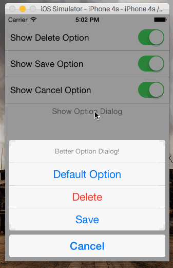

# Better Titanium Option Dialog

[](https://david-dm.org/adammagana/ti-better-option-dialog#info=devDependencies)

> A wrapper for Titanium's Option Dialog that makes it simpler to add option buttons.

## Demonstration



## Code

### Installation

```bash
gittio install com.magana.betteroptiondialog
```

### Example

```javascript
var BetterOptionDialog = require('com.magana.betteroptiondialog');

var optionDialog = BetterOptionDialog.create({
    options: [
        {
            callback: function (optionDialogEventData) {
                // Code to save something here
            },
            title: 'Save'
        },
        {
            callback: function (optionDialogEventData) {
                // Code to delete something here
            },
            destructive: true,
            title: 'Delete'
        },
        {
            cancel: true,
            title: 'Cancel'
        }
    ],
    title: 'Better Option Dialog!'
});

optionDialog.show();
```
